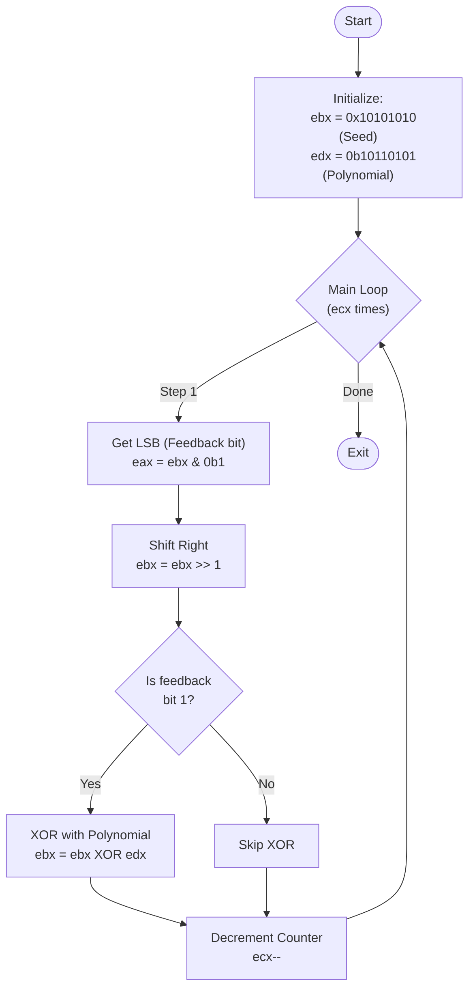

# LFSR Assembly Implementation

This repository contains an implementation of a Linear Feedback Shift Register (LFSR) in x86 assembly language. The program generates pseudo-random numbers using the LFSR algorithm.

## Running the Program

There are two methods to run and analyze the program:

### Method 1: Direct Execution
```bash
# Assemble the code
nasm -f elf32 main.asm -o main.o

# Link the object file
ld -m elf_i386 main.o -o main

# Execute the program
./main
```

### Method 2: Debugging and Analysis with GDB
This method allows you to analyze the program execution step by step and monitor register values.

1. Assemble and link the program:
```bash
nasm -f elf32 main.asm -o main.o
ld -m elf_i386 main.o -o main
```

2. Start GDB:
```bash
gdb ./main
```

3. Inside GDB, use these commands:
```bash
# Set a breakpoint at the main loop
break main_loop

# Display registers window
layout regs

# Start the program
run
```

Note: You might see prompts to install additional GDB packages. You can safely decline these by pressing [n]. This won't affect the program's execution.

4. Viewing Results:
- The pseudo-random number will be displayed in the ebx register
- To generate the next number and continue to the next iteration, use:
```bash
continue
```

## Key concepts of the LFSR algorithm
### Basic terminology
#### Bits position
- **MSB (Most Significant Bit)**: The leftmost bit in the register, having the highest value (2^n-1)
  ```
  Example in 8-bit: [1]0101010
                     ↑ MSB = 1
  ```
- **LSB (Least Significant Bit)**: The rightmost bit in the register, having value 2^0 = 1
  ```
  Example in 8-bit: 10101010[1]
                            ↑ LSB = 1
  ```
Note: MSB and LSB are relative terms and depend on the endianness of the system, i.e., big-endian or little-endian.

#### Register operations
- **Shift Right**: Moving all bits one position to the right, LSB is lost
  ```
  Before: 1011 0101
  After:  0101 1010
  ```
- **Shift Left**: Moving all bits one position to the left, MSB is lost
  ```
  Before: 1011 0101
  After:  0110 1010
  ```

Note: shif operations fill the empty bit with 0, and the lost bit is discarded.

### LFSR Algorithm

#### feedback mechanism
- The polynomial is a mathematical representation of which bits participate in feedback
- The feedback is only calculated if the condition is met (e.g., the LSB is 1)
- In the feedback mechanism the specific bit positions that are used in feedback calculation are called **taps**.
- In my current polynomial (0b10110101), taps are at positions 7, 5, 4, 2, and 0
  ```
  Register:   [1] 0 [1] [1] 0 [1] 0 [1]
  Position:    7  6  5   4  3  2  1  0
  Taps:        ↑     ↑   ↑     ↑     ↑
  ```

#### Seed value
- Initial value loaded into the register
- Must be non-zero to avoid the zero-lock state
- My current implementation uses: 0x10101010
  ```
  Hex:        1    0    1    0    1    0    1    0
  Binary: 0001 0000 0001 0000 0001 0000 0001 0000
  ```

#### Flowchart of the LFSR algorithm
